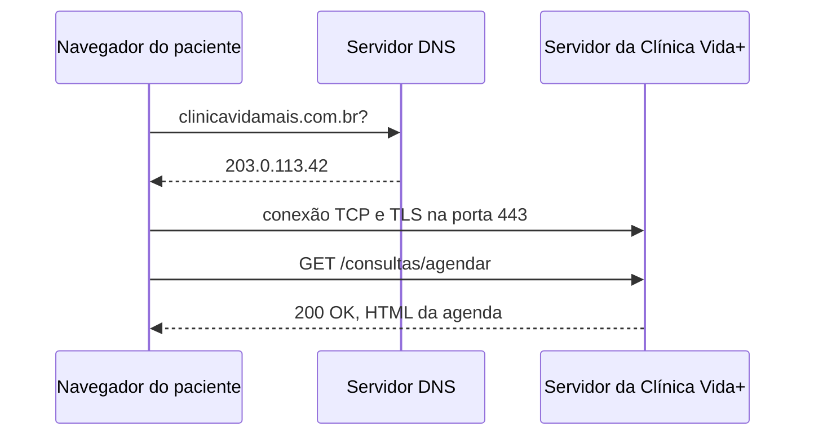

## O caminho de uma requisição



## Evidência do DNS

```text
Name       Type   TTL   Section   IPAddress
----       ----   ---   -------   ---------
github.com A      59    Answer    4.228.31.150
```

## Evidência do HTTP

| Recurso | Método | Código de Status |
| :--- | :--- | :--- |
| `?locale=pt-br` | `GET` | `200` |
| `dashboard-bbb1e555ff0e0168.js` | `GET` | `200` |
| `I54.5a15610413463398.module.css` | `GET` | `200` |
| `4178343?s=408&v=4` | `GET` | `200` |

## Segurança da Comunicação (HTTPS)

O formulário de agendamento da Clínica Vida+ precisa de utilizar o protocolo HTTPS para garantir que toda a comunicação entre o navegador do paciente e o servidor seja encriptada. Sem esta camada de proteção (TLS), os dados transitariam na rede em texto limpo, ficando vulneráveis a interceção e leitura por terceiros. Esta segurança é absolutamente obrigatória neste cenário, uma vez que o formulário carrega dados altamente sensíveis, como os sintomas descritos pelo paciente, o seu histórico médico e o seu número de identificação (CPF).